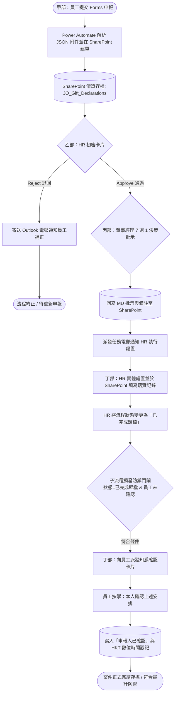

# JO-DOIS: 東淦利益申報系統
### Jumbo Orient Declaration of Interests System (Form HRF-031)

> **"Zero-License, Full-Audit Enterprise Conflict of Interest & Gift Governance Engine"**  
> **「零額外授權成本、全鏈路審計追蹤之企業利益衝突與饋贈治理系統」**

---

## 📌 專案摘要 (Executive Summary)

**東淦利益申報系統 (JO-DOIS)** 是一套針對香港企業反貪政策（香港法例第 201 章《防止賄賂條例》POBO）及內部內控審計要求設計的無紙化治理方案。

本專案將企業傳統紙本「接受饋贈/利益/於賭博活動中獲得利益申報表 (HRF-031)」全面數位化，以 **Microsoft 365 原生生態（Forms、SharePoint Online、Power Automate 及 Approvals）** 為基礎架構，在**無需購買 Power Platform Premium 授權**的前提下，實現「員工申報 ➔ 附件自動歸檔 ➔ HR初審 ➔ 董事經理 7 選 1 批示 ➔ HR落實處置 ➔ 員工知悉確認閉環」的全自動化作業。

---

## 🏛️ 流程生命週期與治理閉環 (Workflow Lifecycle)

傳統紙本流程的最大痛點是「處置結果未通知員工、無簽署時間戳記、審計鏈斷裂」。JO-DOIS 透過雙流程架構達成 100% 封閉式治理閉環（Closed-Loop Governance）：

---

## 📋 業務四部曲對照表 (Governance Matrix)

| 階段 | 責任角色 | 承載平台 | 處置動作與審計紀錄 |
| --- | --- | --- | --- |
| **甲部：申報** | 申報同事 | Microsoft Forms | 填報 10 項揭露資訊、估值並上傳證明文件/相片；系統自動生成標準單號（`DEC-YYYYMMDD-ID`）。 |
| **乙部：初審** | HR 團隊 (`hrd@...`) | Outlook / Teams Approvals | 核實申報完整性與合規性，一鍵 Approve 送呈董事經理，或 Reject 退回並附帶修改意見。 |
| **丙部：批示** | 董事經理 | 自訂 Approvals 卡片 | 於 7 種法定處置選項中選取一項（保留/陳列/分享/抽獎/慈善/退回/其他），並於備註輸入具體指令。 |
| **丁部：落實** | HR 團隊 (`hrd@...`) | SharePoint Online | 收到處置任務通知後執行物理處置，將執行結果登錄至清單並標記為「已完成歸檔」。 |
| **丁部：閉環** | 申報同事 | Outlook / Teams Approvals | 員工按掣「本人確認上述安排」，系統自動蓋印 HKT 數位時間戳記，達成完整法律防禦與內控閉環。 |

---

## ⚙️ 技術亮點 (Technical Implementation)

1. **零額外授權架構 (Zero-License Cost)**：全流程採用 Standard Connectors（Forms、SharePoint、Outlook、Approvals），替企業節省昂貴的 Power Apps / Power Automate Premium 授權費用。
2. **多附件動態解析管線**：透過 `Parse JSON` 與 `Get file content using path`，自動將 Forms 上傳至個人 OneDrive 暫存資料夾的相片與單據，批量轉入企業 SharePoint 核心清單作為永久附件。
3. **無限迴圈防禦 (Infinite Loop Defense)**：在子流程採用「前置狀態門閘 (Condition Gate)」雙重檢驗（`流程狀態=已完成歸檔` 且 `申報人確認狀態≠申報人已確認`），當最後一步寫入確認狀態與 HKT 時間戳記時，自動阻斷二次觸發，徹底根絕無窮迴圈與額度消耗。
4. **時區標準化 (Timezone Normalization)**：全面將雲端預設的 UTC 時間轉為香港標準時間（`China Standard Time` / UTC+8），符合香港法定文件審計標準。

---

## 📄 版權與聲明 (License)

本專案採 MIT License 授權發佈。專為企業人資合規、內控審計與無紙化治理設計。
